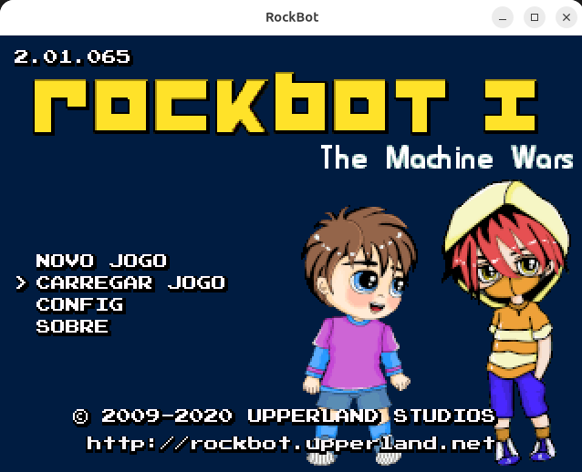
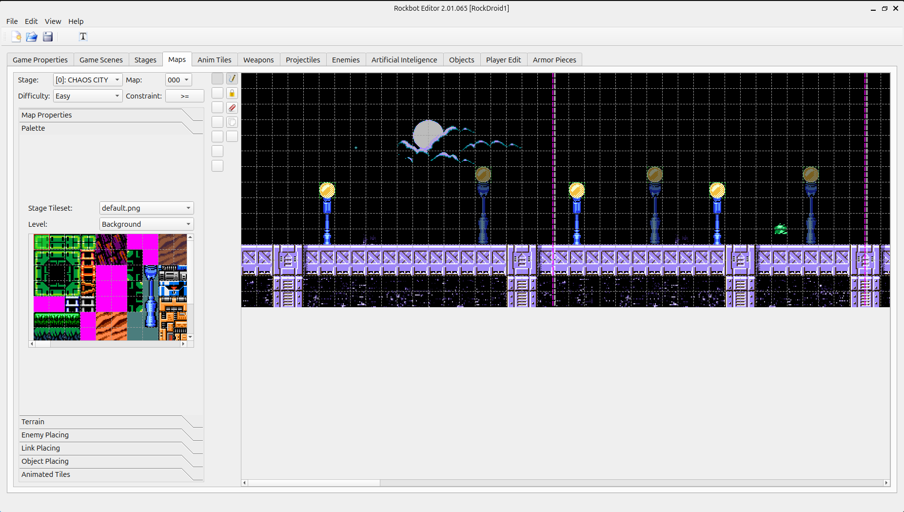

[](https://github.com/protoman/rockbot/actions/workflows/cd.yml)


# Rockbot Engine

**Rockbot** is an open-source SDL game engine inspired by classic NES titles like **Mega Man**. It includes a Qt-based editor to create custom stages, enemies, weapons, and graphics.

See [manual](docs/manual.pdf) or [manual\_famicom](docs/manual_famicom.pdf)

## Requirements

* SDL 2
* Qt5

## Build

```bash
./build-ubuntu.sh
```

## Run

* Game
```bash
(cd build && ./rockbot)
```



* Editor

```bash
(cd build && GTK_PATH= ./editor)
```




## Supported Platforms

Linux, Windows, OSX, Raspberry Pi, Dingux, PocketGo, PS2, PS3, PSP, OpenPandora, Wii, Dreamcast